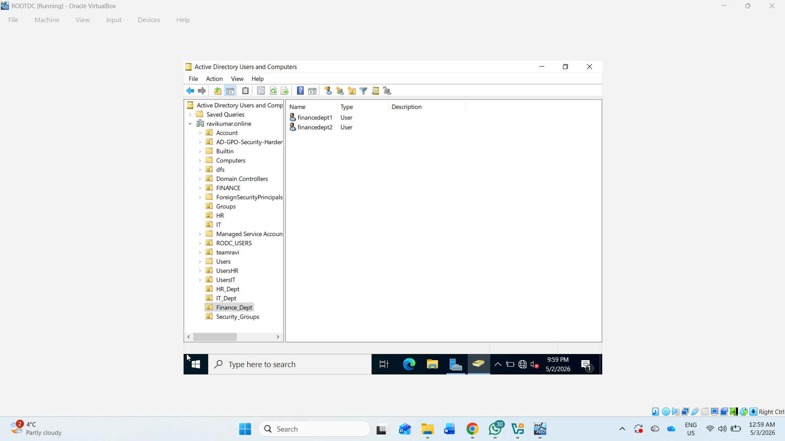
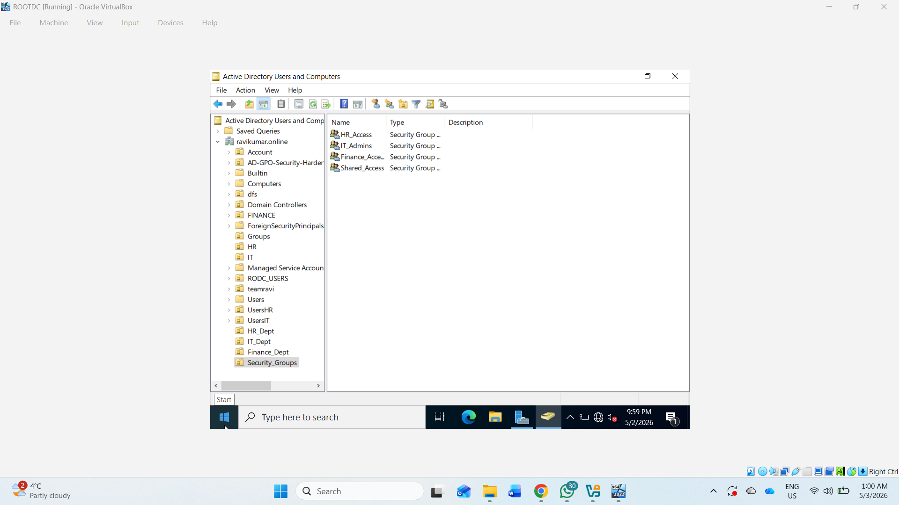
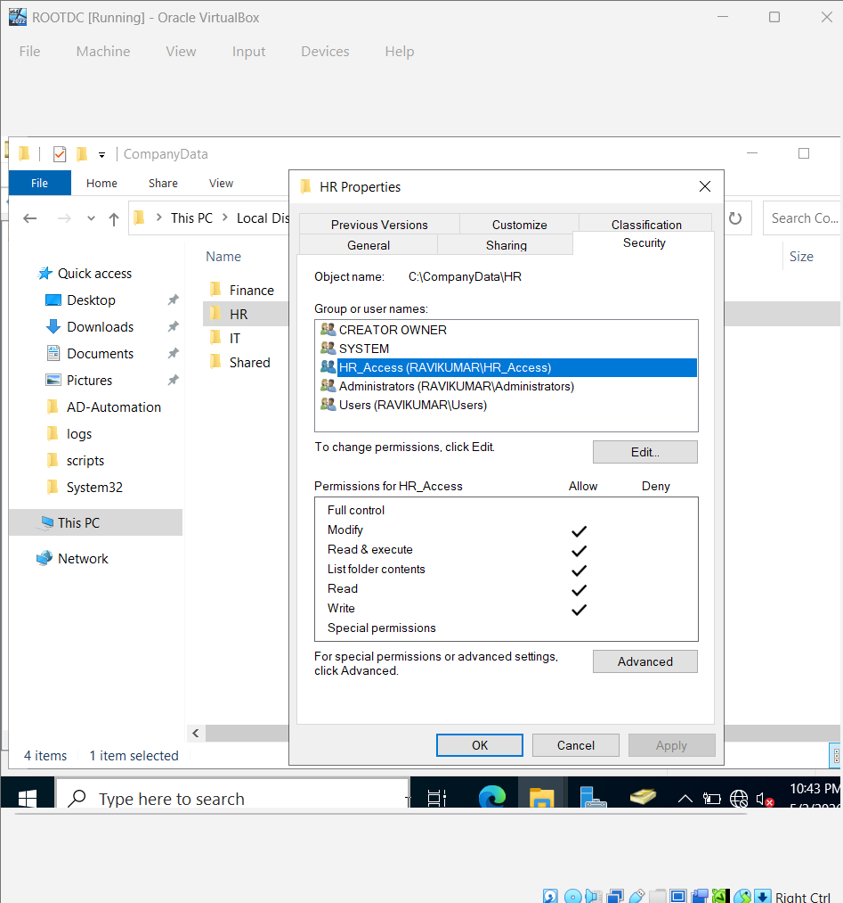
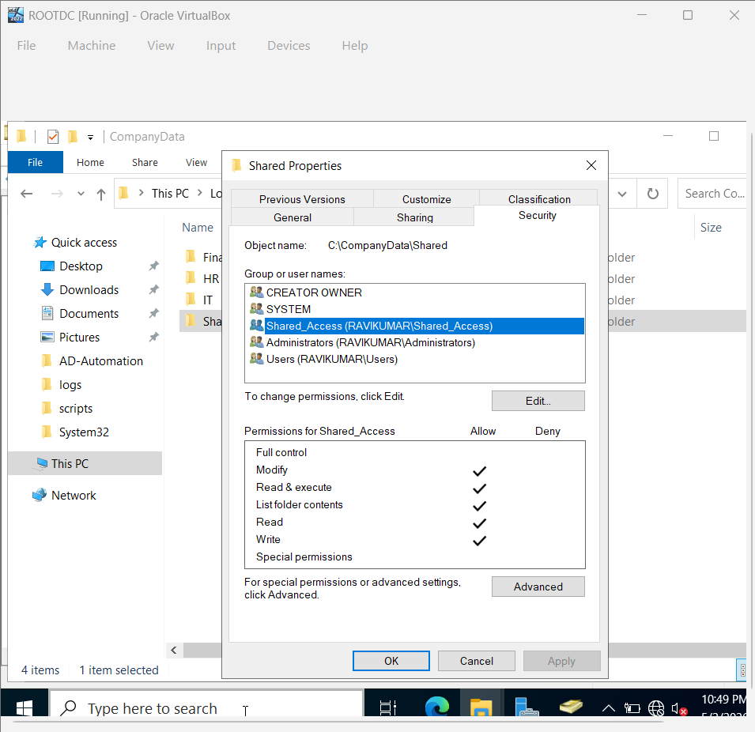
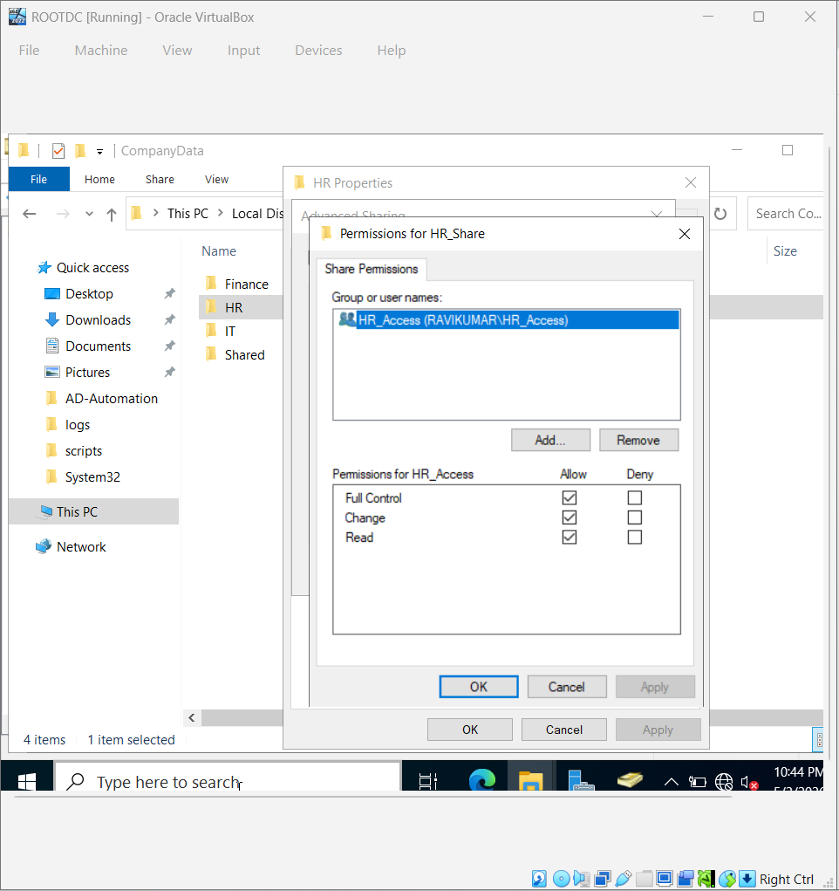
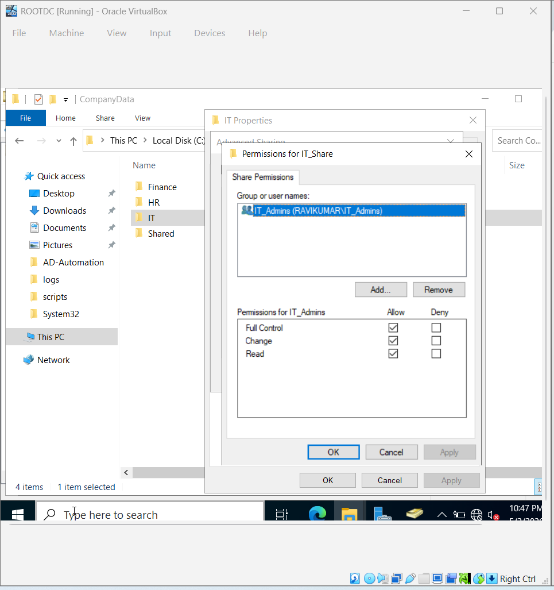
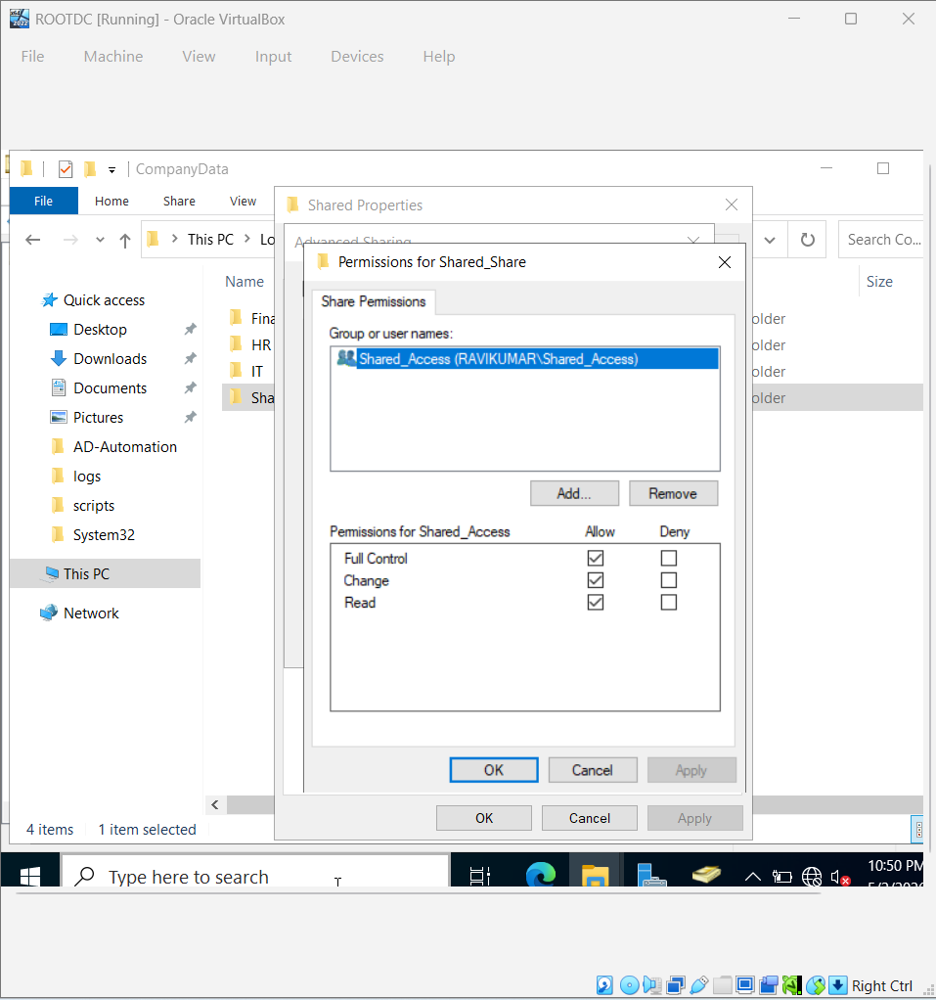

# 🔐 AD-RBAC-Implementation

## 📌 Overview

This project demonstrates **Role-Based Access Control (RBAC)** implementation using **Active Directory** and **NTFS permissions** in a Windows Server environment.

The goal is to ensure that users can only access resources based on their job roles (HR, IT, Finance).

## 🏗️ Lab Environment

* Windows Server (Domain Controller / ADC)

* Active Directory Domain Services (AD DS)

* File Server with shared folders

* Domain-joined client machine

## 📂 Active Directory Structure

### Organizational Units (OUs)

* HR_Dept

* IT_Dept

* Finance_Dept

* Security_Groups

## 👥 Users

### HR

* hrdept1

* hrdept2

### IT

* itdept1

* itdept2

### Finance

* financedept1

* financedept2

## 🔐 Security Groups (RBAC Roles)

* HR_Access

* IT_Admins

* Finance_Access

* Shared_Access

## RBAC Mapping

| Department | Users        | Group          | Access         |
| ---------- | ------------ | -------------- | -------------- |
| HR         | hrdept1      | HR_Access      | HR Folder Only |
| IT         | itdept1      | IT_Admins      | IT Folder Only |
| Finance    | financedept1 | Finance_Access | Finance Folder |

SECURITY_GROUPS

## 📁 Folder Structure

C:\CompanyData\

* HR

* IT

* Finance

* Shared

## 🔐 Permissions Design

### NTFS Permissions

* HR → HR_Access (Modify)

* IT → IT_Admins (Modify)
  

* Finance → Finance_Access (Modify)

* Shared → Shared_Access (Modify)

### Share Permissions

* Configured using respective security groups

* Full Control granted at share level

* Final access controlled by NTFS (most restrictive)

## 🧪 Access Testing (Proof of RBAC)

### HR User

* Access HR_Share → ✅ Allowed

* Access Finance_Share → ❌ Denied

### IT User

* Access IT_Share → ✅ Allowed

* Access HR_Share → ❌ Denied

### Finance User

* Access Finance_Share → ✅ Allowed

* Access IT_Share → ❌ Denied

### Shared Folder

* Accessible by all users → ✅

## 📸 Screenshots (Add your images)

Add screenshots in a folder like:

screenshots/

Examples:

* AD structure

* Users & Groups

* NTFS permissions

* Share permissions

* Access denied proof

## 💡 Key Concepts Demonstrated

* Role-Based Access Control (RBAC)

* Active Directory user & group management

* NTFS vs Share permissions

* Principle of Least Privilege

* Access verification and testing

## 🚀 Outcome

Successfully implemented a secure, scalable access control model where:

* Users are assigned roles via groups

* Permissions are managed centrally

* Unauthorized access is prevented

## 📚 Skills Gained

* Windows Server Administration

* Active Directory Management

* File Server Configuration

* Security & Access Control

* Troubleshooting Permissions

## 🧠 Author

Ravi Kumar
